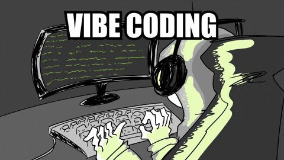

# 👋 Hi, I'm Hasan Shaikh  
*AI Researcher in Cancer Imaging | Radiomics & Deep Learning | Data Scientist at the **Quantitative Imaging Research and Artificial Intelligence Lab (QIRAIL)**, Christian Medical College (CMC), Vellore*

---

🔬 I'm deeply committed to solving **real-world healthcare challenges** through Artificial Intelligence. My primary focus lies in developing **predictive models** and **automated segmentation pipelines** for medical imaging, especially in **Head and Neck Cancer (HNC)**. I work extensively with **radiomics**, **machine learning**, and **deep learning** to push the boundaries of clinical research.

With a strong belief in the **translational impact** of AI, my goal is to bridge the gap between engineering and clinical practice — ensuring that data-driven solutions reach the patient bedside.

---

## 🖥 GitHub Stats

  
   

---

### 🚀 Key Projects

| Project | Description | Repo |
|--------|-------------|------|
| **Head & Neck Cancer Risk Prediction Dashboard** | A full-stack dashboard integrating clinical + radiomics data to predict **locoregional recurrence** in HNC patients. Built with FastAPI (backend), React (frontend), and trained ML models with explainability features. | [View Repo](https://github.com/hash123shaikh/HNC-Risk-Prediction-Dashboard.git) |
| **Radiomics-Based ML Pipeline** *(Private)* | A robust ML pipeline for recurrence prediction using CT imaging. Implements multiple feature selection techniques (LASSO, WOA, PSO) and classifiers (SVM, LR), with extensive cross-validation and ROC/AUC analysis. | *Private — Access upon request* |
| **Auto-Segmentation Toolkit** *(Private)* | An AI-based segmentation framework for identifying tumor volumes in CT scans using **nnUNet** and **MedSAM**. Currently used in prospective clinical studies. | *Private — Access upon request* |

---

### 🧠 Tools & Technologies

---

### 🏆 Achievements & Contributions

  

---

### 🌐 Let’s Connect

- 📧 **Email**: hasanshaikh3198@gmail.com  
- 💼 **LinkedIn**: [linkedin.com/in/hasann-shaikh](https://linkedin.com/in/hasann-shaikh)  
- 🖥️ **Portfolio**: [yourwebsite.com](https://yourwebsite.com)

---

> *“Turning radiomics into real-world impact — one model at a time.”*
